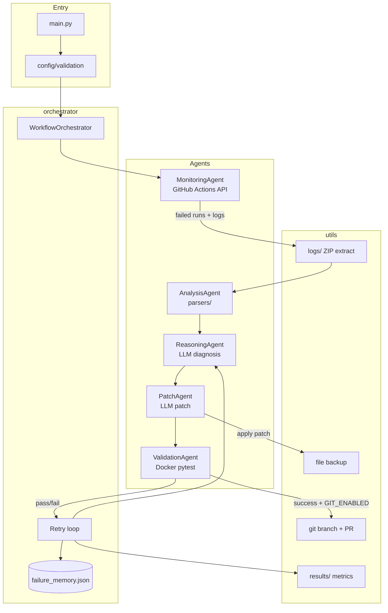

# Self-Healing CI/CD

A multi-agent Python framework that detects GitHub Actions failures, diagnoses them with an LLM, generates patches, validates fixes in Docker, and optionally opens a pull request.

## Quick start

```bash
# Clone and install
python -m venv venv
source venv/bin/activate
pip install -r requirements.txt

# Configure
cp .env.example .env
# Edit .env — set GITHUB_* and OPENAI_API_KEY

# Safe trial (no file writes, no Docker)
DRY_RUN=true python main.py

# Full repair (requires Docker)
python main.py

# Pre-flight check (recommended before live runs)
python main.py check

# Run unit tests
pytest tests/
```

## Production deployment

Full-product flow for teams using GitHub Actions end-to-end.

### 1. One-time setup

```bash
cp .env.example .env
# Set GITHUB_* , OPENAI_API_KEY

# Verify environment
python main.py check
```

Add repository secrets on GitHub (Settings → Secrets → Actions):

| Secret | Required |
|--------|----------|
| `OPENAI_API_KEY` | Yes |
| `GITHUB_PR_TOKEN` | No — use a PAT with `repo` scope if PR creation returns 403 |

Also enable: **Settings → Actions → General → Workflow permissions** → check **Allow GitHub Actions to create and approve pull requests** (required for auto-PR with `GITHUB_TOKEN`).

### 2. Local operator (human approves each patch)

```bash
REQUIRE_APPROVAL=true
AUTO_APPROVE_PATCHES=false
GIT_ENABLED=false
python main.py
```

You will see a unified diff and `[y/N]` prompt before any file is modified.

### 3. Automated CI self-heal (opens PR)

Already configured in [.github/workflows/self-heal.yml](.github/workflows/self-heal.yml):

| Setting | CI value | Purpose |
|---------|----------|---------|
| `AUTO_APPROVE_PATCHES` | `true` | No stdin in Actions |
| `GIT_ENABLED` | `true` | Branch + PR |
| `EXCLUDED_WORKFLOW_NAMES` | Self-heal workflows | Avoid repair loops |

Push to `main` → **Test Pipeline** fails → **Self-Heal on Failure** runs → review PR → merge.

**Note:** Test Pipeline runs `pytest tests/ sample_projects/`. If CI is green, self-heal will not auto-start (nothing to fix). Use **Actions → Self-Heal on Failure → Run workflow** to test manually, or push a failing sample test.

### 4. Offline repair (cached logs, no GitHub API)

```bash
# After a prior run downloaded logs to logs/extracted/{run_id}/
OFFLINE_MODE=true python main.py
```

### 5. Path policy

Only files under `ALLOWED_PATH_PREFIXES` can be patched. Default:

```bash
ALLOWED_PATH_PREFIXES=sample_projects/,app/,src/,lib/,tests/
```

Example real app code lives under `app/` (`app/calculator.py`, `app/tests/`).

### 6. Manual dry-run on GitHub (no CI failure needed)

**Actions → Self-Heal on Failure → Run workflow**

| Input | Recommended for test |
|-------|-------------------|
| `dry_run` | **true** (default) |
| `offline_mode` | false |
| `git_enabled` | false |

Uses OpenAI + GitHub API but does not write files or run Docker.

### 7. Web UI patch approval (local)

```bash
WEB_APPROVAL_ENABLED=true
REQUIRE_APPROVAL=true
AUTO_APPROVE_PATCHES=false
python main.py
# Browser opens http://127.0.0.1:8765 — Approve or Reject

# Or run UI only:
python main.py approve-ui
```

### 8. Multi-language log parsers

Auto-detects Python, Java (Maven/Gradle), and Go from CI logs. Force one:

```bash
LOG_PARSER_LANGUAGE=java   # python | java | go
```

### CLI commands

| Command | Description |
|---------|-------------|
| `python main.py` | Run full orchestrator |
| `python main.py check` | Pre-flight health check |
| `python -m config.check` | Same as check |

## Architecture



**Control flow (one failure):**

1. **Detect** — list failed workflow runs; download log ZIP  
2. **Analyze** — extract errors and target file from logs  
3. **Diagnose** — LLM explains root cause (prompt template)  
4. **Patch** — LLM rewrites target file using diagnosis  
5. **Validate** — Docker build + scoped `pytest`  
6. **Retry** — enrich context and repeat up to `MAX_RETRY_ATTEMPTS`  
7. **Publish** — optional git branch, commit, pull request  

| Package | Role |
|---------|------|
| `orchestrator/` | Agent coordination, retries, batch results |
| `agents/` | Monitoring, analysis, reasoning, patch, validation |
| `config/` | Settings, prompt templates (`config/prompts/`), startup checks |
| `parsers/` | Pluggable log parsers (Python, Java, Go) |
| `utils/` | Logging, backups, git, secrets masking, LLM retries |
| `tests/` | Framework unit tests (`pytest tests/` — 45 tests) |
| `results/` | Runtime JSON metrics and repair history (gitignored) |
| `logs/` | Downloaded workflow ZIPs and extracted logs (gitignored) |

See [UPDATES.md](UPDATES.md) for the full changelog.

### Project layout

```
self-healing-cicd/
├── main.py                 # CLI entry (run, check, approve-ui)
├── agents/                 # Five agents (monitoring → validation)
├── orchestrator/           # WorkflowOrchestrator + retry loop
├── config/
│   ├── settings.py
│   ├── validation.py
│   └── prompts/            # diagnosis.txt, patch.txt (not root prompts/)
├── parsers/                # python_parser, java_parser, go_parser
├── utils/                  # git, approval, offline logs, Docker, etc.
├── tests/                  # Unit tests (45)
├── app/                    # Example application under repair
├── sample_projects/        # Intentionally failing demo targets
├── .github/workflows/      # test.yml, self-heal.yml (not root workflows/)
├── logs/                   # Runtime — created on first log fetch
├── results/                # Runtime — JSON + backups (results/.gitkeep only in git)
├── scripts/                # go-live.sh, trigger-ci-failure.sh
└── Dockerfile              # Validation image for ValidationAgent
```

**Runtime directories** (`logs/`, `results/`) start empty except `results/.gitkeep`. The framework creates JSON, backups, and extracted logs during runs. Those artifacts are gitignored.

**Not used:** Empty root folders named `prompts/`, `workflows/`, or `sandbox/` are leftovers from an early scaffold. Prompts live under `config/prompts/`; CI workflows live under `.github/workflows/`. Safe to delete locally.

### Adoption (today vs planned)

| Model | Status | What adopters do |
|-------|--------|------------------|
| **Reference repo (today)** | Current | Clone this repo (or copy framework tree), configure `.env`, add secrets, run locally or via included workflows |
| **pip package** | Planned | `pip install self-healing-cicd` + `self-heal run` without vendoring source |
| **GitHub Action** | Planned | `uses: org/self-healing-cicd@v1` + `OPENAI_API_KEY` only |

For a thesis or demo, the reference-repo model is enough. For product adoption, the target is install-or-Action, not copying `agents/` and `orchestrator/` into every consumer repo.

---

## How people use this framework

The framework supports three usage modes. Pick one based on how much automation you want.

### Mode 1 — Research / thesis (local, safe)

**Who:** Students, evaluators, or developers exploring the pipeline.

**How:**

1. Configure `.env` with GitHub + OpenAI credentials.  
2. Run `DRY_RUN=true python main.py` to see diagnosis and generated patches **without** changing files or running Docker.  
3. Inspect `results/` and console logs for metrics and failure memory.  
4. Run `pytest tests/` to verify framework behavior without external services.

**Outcome:** Demonstrates multi-agent coordination and persistence; no risk to the repository.

### Mode 2 — Semi-automatic repair (local operator)

**Who:** A developer reacting to a failed CI run on their machine.

**How:**

1. Ensure Docker is running.  
2. Set `DRY_RUN=false`, `GIT_ENABLED=false` (or `true` for PR flow).  
3. Run `python main.py` after a GitHub Actions failure.  
4. Review patched files locally; run `pytest` manually if desired.  
5. Commit or discard changes yourself.

**Outcome:** Faster than manual debugging; human stays in the loop for merge decisions.

### Mode 3 — CI-attached self-healing (hands-off)

**Who:** A team that wants the repo to react when **Test Pipeline** fails.

**How:**

1. Add repository secret `OPENAI_API_KEY`.  
2. Keep [.github/workflows/self-heal.yml](.github/workflows/self-heal.yml) enabled (triggers on failed **Test Pipeline**).  
3. Set `GIT_ENABLED=true` in the workflow (already configured there).  
4. On failure: Actions runs `python main.py` → validate → push branch → open PR.  
5. A human reviews and merges the PR.

**Outcome:** Closest to “production”; still requires human PR review before `main` changes.

### Completing the project beyond a thesis demo

| Step | Action |
|------|--------|
| 1 | Document one real failed run in your write-up (before/after logs, `results/run_*.json`) |
| 2 | Run Mode 1 locally and capture screenshots or metrics |
| 3 | Run Mode 3 once on GitHub with `OPENAI_API_KEY` secret and a deliberate test failure |
| 4 | State limitations honestly (see below) — reviewers expect this |

The `sample_projects/` targets are **intentionally broken** demos. For a “completed” story, either fix one sample via the orchestrator or point the framework at a repo where your own CI failed.

---

## Environment variables

Copy [.env.example](.env.example). Key settings:

| Variable | Required | Description |
|----------|----------|-------------|
| `GITHUB_TOKEN` | Live mode | Repo access + Actions logs |
| `GITHUB_OWNER` | Live mode | Repository owner |
| `GITHUB_REPO` | Live mode | Repository name |
| `OPENAI_API_KEY` | Always | LLM diagnosis and patching |
| `DRY_RUN` | No | `true` = no writes, no Docker |
| `GIT_ENABLED` | No | `true` = branch, commit, push, PR |
| `REQUIRE_APPROVAL` | No | `true` = prompt before apply (local) |
| `AUTO_APPROVE_PATCHES` | No | `true` = skip prompt (CI default) |
| `OFFLINE_MODE` | No | `true` = use `logs/extracted/` only |
| `ALLOWED_PATH_PREFIXES` | No | Comma-separated path allowlist |

## Git integration

When `GIT_ENABLED=true` and a repair validates successfully:

1. Creates branch `self-heal/run-{id}-{timestamp}`
2. Commits repaired files
3. Pushes to GitHub
4. Opens a PR (if `GIT_CREATE_PR=true`)

Requires a git repository with `GITHUB_TOKEN` push permission.

## CI integration

- **Unit tests:** [.github/workflows/test.yml](.github/workflows/test.yml) runs `pytest tests/`
- **Self-heal on failure:** [.github/workflows/self-heal.yml](.github/workflows/self-heal.yml) runs the orchestrator when **Test Pipeline** fails

## Outputs

| Path | Content |
|------|---------|
| `results/failure_memory.json` | Repair history |
| `results/run_*.json` | Per-run outcomes |
| `results/metrics_summary.json` | Aggregate metrics |
| `logs/` | Downloaded workflow logs |

---

## Limitations

This section summarizes what the framework **does not** guarantee. Useful for thesis evaluation and production planning.

### Scope and correctness

- **Python-centric validation** — Log parsers cover Python, Java, and Go, but Docker validation still runs `pytest`. JVM/Go repos may need custom validation beyond this framework.
- **LLM unpredictability** — Patches can be wrong, incomplete, or stylistically odd even when validation passes (tests may not cover the real failure).
- **Single-repo, single-provider** — GitHub Actions only; no GitLab, Jenkins, or CircleCI.
- **No semantic code understanding** — Repairs are text-based (LLM + file replace), not AST-aware refactors.

### Operations

- **Docker required** for live validation — Not optional in non-dry-run mode.
- **API costs** — Every diagnosis and patch calls OpenAI; retries multiply usage.
- **No guaranteed PR merge** — Opens a PR; humans must review. No auto-merge.
- **Git state assumptions** — Git integration expects a clean enough repo; complex multi-branch workflows may need manual conflict resolution.

### Security and safety

- **Broad file write** — A bad patch overwrites the target file; backup/rollback mitigates but does not eliminate risk.
- **Token scope** — `GITHUB_TOKEN` needs Actions read and (for git mode) contents write. Leaked tokens expose the repo.
- **Secrets in logs** — Masking reduces risk; DEBUG logging can still expose sensitive context if enabled carelessly.

### CI behavior

- **Self-heal trigger** — Only reacts to failures of the workflow named **Test Pipeline**; rename requires updating `self-heal.yml`.
- **No infinite-loop protection beyond skipping PR events** — Repeated failures could open multiple PRs if not configured (`STOP_ON_FIRST_SUCCESS`, run limits).
- **First failures only by default** — `MAX_FAILED_RUNS` and `MAX_FAILURES_PER_RUN` cap work; very noisy pipelines may need tuning.

### Implemented product safeguards

- Human approval before apply (`REQUIRE_APPROVAL` / diff prompt)  
- Path allowlist (`ALLOWED_PATH_PREFIXES`)  
- Self-heal workflow excluded from triggers (loop guard)  
- GitHub API retry on rate limits  
- Pre-flight check (`python main.py check`)  

### Remaining gaps for enterprise adoption

- **Distribution** — No published pip package or marketplace GitHub Action yet; adopters vendor this repo today (see [Adoption](#adoption-today-vs-planned))  
- **Validation stack** — Docker + `pytest` only; Java/Go parsers help find targets but validation is still Python-centric  
- **Staging / E2E** — No automated integration suite against live GitHub + Docker in CI  
- **Auto-merge** — PRs are opened for human review; no optional auto-merge policy  
- **Multi-CI** — GitHub Actions only (no GitLab, Jenkins, CircleCI)  

### Already implemented (not gaps)

- Pluggable log parsers: `parsers/` (Python, Java, Go) — `LOG_PARSER_LANGUAGE` to force  
- Web approval UI: `WEB_APPROVAL_ENABLED`, `python main.py approve-ui`  
- Terminal approval, path allowlist, offline mode, git branch + PR, pre-flight `check`  

---

## License

See repository license file if present.
