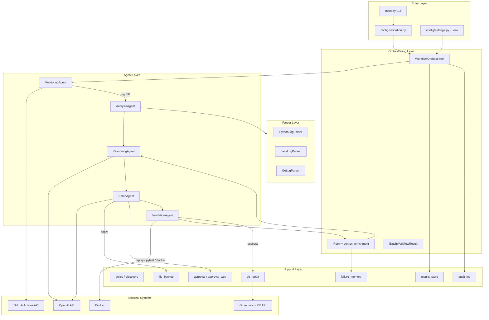
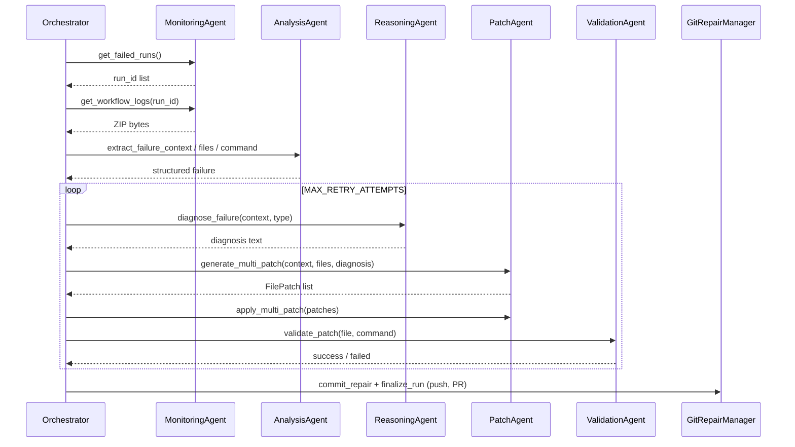

# Architecture & Defense Guide

> Part of the [project documentation](../README.md).

This document is the authoritative reference for how the project is designed, built, and evaluated. It is written for thesis defense, technical review, and onboarding: you should be able to answer jury questions from this page alone.

**Version:** 0.1.11
**Author:** Nyuydine Bill
**Repository:** [self-healing-cicd](https://github.com/NyuydineBill/self-healing-cicd)

---

## Table of contents

1. [Problem statement & research contribution](#1-problem-statement--research-contribution)
2. [High-level architecture](#2-high-level-architecture)
3. [End-to-end control flow](#3-end-to-end-control-flow)
4. [Component reference](#4-component-reference)
5. [Multi-agent design rationale](#5-multi-agent-design-rationale)
6. [Data & persistence](#6-data--persistence)
7. [Deployment modes](#7-deployment-modes)
8. [CI/CD integration](#8-cicd-integration)
9. [Security & safety model](#9-security--safety-model)
10. [Evaluation methodology](#10-evaluation-methodology)
11. [Technology stack](#11-technology-stack)
12. [Limitations & future work](#12-limitations--future-work)
13. [Jury Q&A — anticipated questions](#13-jury-qa--anticipated-questions)

---

## 1. Problem statement & research contribution

### The problem

Modern CI/CD pipelines fail frequently. When they do, a developer must:

1. Notice the failure (monitoring)
2. Download and read logs (analysis)
3. Understand the root cause (reasoning)
4. Write a fix (patching)
5. Re-run tests to confirm (validation)
6. Commit and open a PR (delivery)

This is repetitive, slow, and error-prone — especially for common failure classes (assertion mismatches, import errors, syntax errors, off-by-one bugs).

### What this project does

**Self-Healing CI/CD** is a **multi-agent Python framework** that automates steps 1–6 for **GitHub Actions** failures:

| Step | Automated by |
|------|----------------|
| Detect failed runs | `MonitoringAgent` |
| Parse logs, find files & commands | `AnalysisAgent` + `parsers/` |
| Diagnose root cause (LLM) | `ReasoningAgent` |
| Generate code fixes (LLM) | `PatchAgent` |
| Validate fixes locally | `ValidationAgent` |
| Branch, commit, PR | `GitRepairManager` |

A central **`WorkflowOrchestrator`** coordinates agents, manages retries, enforces policy, and persists outcomes.

### Research / engineering contribution

1. **Multi-agent decomposition** — Separates concerns (monitor vs. analyze vs. reason vs. patch vs. validate) instead of one monolithic LLM call.
2. **Closed-loop repair** — Failed validation feeds enriched context back into the next attempt (up to `MAX_RETRY_ATTEMPTS`).
3. **CI-faithful validation** — Replays the **exact failing CI command** when safe; falls back to scoped `pytest` or Docker.
4. **Multi-file atomic repair** — One LLM call can patch all files involved in a failure (e.g. `app.py` + test).
5. **Production safeguards** — Path allowlists, human approval, backups, audit logs, loop guards, offline mode for reproducible experiments.
6. **Empirical evaluation** — 15 controlled failure scenarios under `sample_projects/` plus an experiment runner (`scripts/run_experiments.py`).

---

## 2. High-level architecture



### Layered package layout

```
self-healing-cicd/
├── main.py                 # CLI: run | check | approve-ui
├── orchestrator/           # WorkflowOrchestrator — brain of the system
├── agents/                 # Five specialized agents
├── parsers/                # Pluggable log parsers (Python, Java, Go)
├── config/                 # Settings, validation, prompt templates
├── utils/                  # Cross-cutting: git, policy, approval, logging, …
├── tests/                  # ~50 unit tests (framework behavior)
├── app/                    # Example real application (calculator)
├── sample_projects/        # 15 intentional failure demos (project_1 … project_15)
├── scripts/                # break-sample, experiments, demo tooling
├── .github/workflows/      # test.yml (CI) + self-heal.yml (auto-repair)
├── logs/                   # Runtime: downloaded ZIPs + extracted logs
├── results/                # Runtime: JSON metrics, failure memory, audit log
└── Dockerfile              # Validation image (pytest fallback)
```

**Design principle:** Agents are **execution units**; the orchestrator owns **control flow, retries, and persistence**. Configuration is centralized in `config/settings.py` and loaded from environment variables.

---

## 3. End-to-end control flow

### Happy path (live mode, CI failure)

```
GitHub Actions "Test Pipeline" fails
        │
        ▼
"Self-Heal on Failure" workflow triggers (workflow_run)
        │
        ▼
main.py → validate_configuration() → WorkflowOrchestrator.run()
        │
        ▼
MonitoringAgent.get_failed_runs()
  • Uses GITHUB_TRIGGER_RUN_ID when set (CI passes the failing run)
  • Filters excluded workflows (self-heal itself)
  • Filters target workflows ("Test Pipeline")
        │
        ▼
MonitoringAgent.get_workflow_logs(run_id) → ZIP bytes
        │
        ▼
save_and_extract_logs() → logs/extracted/{run_id}/
        │
        ▼
For each job log file (skipping runner system logs):
  AnalysisAgent.extract_failure_context(log)     → error lines
  AnalysisAgent.extract_failed_files(log)        → all .py paths in traceback
  AnalysisAgent.extract_failing_command(log)     → pytest/ruff/mypy/… command
  _resolve_target_file()                         → primary file to fix
  enforce_path_policy(target_file)               → must be under allowlist
        │
        ▼
_repair_with_retries()  [up to MAX_RETRY_ATTEMPTS times]
  1. ReasoningAgent.diagnose_failure()           → LLM diagnosis
  2. PatchAgent.generate_multi_patch()           → LLM JSON array of file fixes
     (fallback: single-file generate_patch)
     (shortcut: deterministic_assertion_test_fix for simple assert failures)
  3. request_patch_approval()                    → human or auto-approve
  4. PatchAgent.apply_multi_patch()              → atomic file writes
  5. ValidationAgent.validate_patch()            → replay CI command or pytest
  6. On failure: restore backups, enrich context, retry
  7. On success: git commit → push → open PR
        │
        ▼
Results persisted to results/run_{id}.json, failure_memory.json, audit.log
```

### Target file resolution (priority order)

The orchestrator must pick **which file to patch** when logs mention many paths:

1. **Sample project preference** — paths under `sample_projects/` win over framework `tests/`
2. **Parser extraction** — `AnalysisAgent.extract_failed_file()` via language-specific parser
3. **Broad regex scan** — any `dir/file.py` in log that passes path policy and exists on disk
4. **Basename match** — against discovered test files
5. **Last resort** — first discovered test target

Multi-file scope is then limited to the same **validation scope** (e.g. `sample_projects/project_11/`) so unrelated files are not patched.

### Retry loop

When validation fails, the orchestrator **enriches** the failure context:

```
Original CI errors
+ "Previous repair attempt failed validation"
+ validation status, scope, command
+ last 2000 chars of validation output
```

This is fed back into `ReasoningAgent` on the next attempt. Failed attempts are recorded in `failure_memory.json`.

---

## 4. Component reference

### 4.1 Entry point — `main.py`

| Command | Purpose |
|---------|---------|
| `python main.py` | Run full orchestrator |
| `python main.py check` | Pre-flight: API keys, Docker, prompt files |
| `python main.py approve-ui` | Standalone web approval server |

Exit codes: `0` on success or no failures; `1` if repairs exhausted; `2` on configuration error.

### 4.2 Orchestrator — `orchestrator/workflow.py`

**Class:** `WorkflowOrchestrator`

**Key dataclasses:**

| Type | Fields of note |
|------|----------------|
| `RepairAttempt` | attempt number, diagnosis, patch, validation result |
| `WorkflowResult` | per-failure outcome; `target_files` for multi-file |
| `BatchWorkflowResult` | aggregates multiple `WorkflowResult` |

**Modes:**

- **Live** — GitHub API + log download
- **Offline** — `logs/extracted/` only (`OFFLINE_MODE=true`)
- **Dry-run** — diagnosis + patch generation, no writes, no validation (`DRY_RUN=true`)

**Caps:**

| Setting | Default | Meaning |
|---------|---------|---------|
| `MAX_FAILED_RUNS` | 5 | How many failed workflow runs to process |
| `MAX_FAILURES_PER_RUN` | 10 | Failures per run (deduped by run_id + file) |
| `MAX_RETRY_ATTEMPTS` | 3 | Patch-validate cycles per failure |
| `STOP_ON_FIRST_SUCCESS` | true | Stop batch after first successful repair |

### 4.3 MonitoringAgent — `agents/monitoring_agent.py`

**Responsibility:** Talk to GitHub Actions REST API.

| Method | Behavior |
|--------|----------|
| `get_failed_runs()` | List failed runs; honor `GITHUB_TRIGGER_RUN_ID`, exclusions, targets |
| `get_workflow_logs(run_id)` | Download log archive (ZIP) |

Uses `utils/http_retry.py` for rate-limit resilience. Requires `GITHUB_TOKEN` with `actions:read`.

### 4.4 AnalysisAgent — `agents/analysis_agent.py`

**Responsibility:** Turn raw log text into structured repair inputs.

| Method | Output |
|--------|--------|
| `extract_failure_context(log)` | List of error lines (via parser) |
| `extract_failed_file(log)` | Single primary file (parser → LLM fallback) |
| `extract_failed_files(log)` | All traceback `.py` paths that exist on disk |
| `extract_failing_command(log)` | CI command safe to replay locally |

**Command replay safety:** Binary must be in allowlist (`pytest`, `ruff`, `mypy`, `go`, …). Blocked patterns: `rm`, `git push`, `sudo`, `--force`, etc.

### 4.5 ReasoningAgent — `agents/reasoning_agent.py`

**Responsibility:** LLM root-cause diagnosis.

- Loads template `config/prompts/diagnosis.txt`
- Substitutes `{failure_context}` and `{failure_type}`
- `failure_type` comes from `utils/errors.categorize_failure()` (assertion, import, syntax, …)
- Uses `utils/llm_client.chat_completion_with_retry()` for resilience

### 4.6 PatchAgent — `agents/patch_agent.py`

**Responsibility:** LLM code generation and file writes.

| Method | When used |
|--------|-----------|
| `generate_multi_patch()` | Multiple files in failure scope |
| `generate_patch()` | Single file fallback |
| `apply_patch()` / `apply_multi_patch()` | Write to disk (atomic temp file + replace) |

**Context collection:** `_collect_context_files()` reads primary files **and** locally imported modules so the LLM sees related source.

**Multi-patch format:** LLM returns JSON array `[{"file": "path", "content": "full file"}]` parsed by `_parse_multi_patch()`; only explicitly allowed target files are accepted.

**Deterministic shortcut:** For single-file `AssertionError` in tests, `deterministic_assertion_test_fix()` can fix `assert actual == wrong_expected` without an LLM call.

### 4.7 ValidationAgent — `agents/validation_agent.py`

**Responsibility:** Prove the patch fixes the failure.

**Validation strategy (priority order):**

1. **Scoped direct pytest** — if `target_file` maps to a sample project or app scope
2. **CI command replay** — re-run extracted failing command (normalized: local Python, strip `--cov`, override pytest.ini addopts)
3. **Docker + pytest** — build `Dockerfile`, run scoped tests in container
4. **Direct pytest** — if no Dockerfile

Returns dict: `{status, output, category, scope}` where `status` ∈ `success | failed | error | build_failed | dry_run`.

### 4.8 Parsers — `parsers/`

| Parser | `language` | Detects |
|--------|------------|---------|
| `PythonLogParser` | `python` | pytest tracebacks, AssertionError, FAILED lines |
| `JavaLogParser` | `java` | Maven/Gradle `[ERROR]`, `.java` paths |
| `GoLogParser` | `go` | `--- FAIL:`, panic, `.go` paths |

Selection: `LOG_PARSER_LANGUAGE` override, else first `matches(log)`, else Python default.

### 4.9 Configuration — `config/settings.py`

Single `Settings` dataclass loaded from `.env` via `python-dotenv`. Key groups:

- **GitHub** — token, owner, repo, trigger run ID, workflow filters
- **OpenAI** — API key, model (`gpt-4o-mini` default), timeout, retries
- **Orchestration** — retry limits, dry-run, offline, sample_projects_dir
- **Safety** — approval, path prefixes, backup
- **Git** — enabled, PR, branch prefix, DCO sign-off
- **Validation** — Docker tag, timeout (120s default)

`get_settings()` is a singleton — consistent config across agents.

### 4.10 Support utilities (selected)

| Module | Role |
|--------|------|
| `utils/policy.py` | `ALLOWED_PATH_PREFIXES` + `auto` discovery of source dirs |
| `utils/file_backup.py` | Per-run backups; restore on validation failure |
| `utils/git_repair.py` | Branch, commit, push, PR via GitHub API |
| `utils/failure_memory.py` | Append-only JSON repair history |
| `utils/results_store.py` | Per-run JSON + metrics summary |
| `utils/audit_log.py` | NDJSON audit trail in `results/audit.log` |
| `utils/approval.py` | Terminal diff prompt; delegates to web UI |
| `utils/approval_web.py` | Local HTTP UI at `:8765` |
| `utils/secrets.py` | Mask tokens in logs |
| `utils/prompts.py` | Load templates; strip injection patterns |
| `utils/discovery.py` | Find test files and source under allowed prefixes |
| `utils/validation_scope.py` | Map file → `sample_projects/project_N/` scope |
| `utils/log_extractor.py` | Unzip and iterate job logs |
| `utils/offline_logs.py` | Read cached extracts for offline mode |
| `utils/docker_utils.py` | Build/run/cleanup validation containers |
| `utils/errors.py` | `ErrorCategory` enum + pattern-based classification |

---

## 5. Multi-agent design rationale

### Why five agents instead of one LLM?

| Concern | Benefit of separation |
|---------|----------------------|
| **Testability** | Each agent has unit tests with mocked I/O |
| **Swapability** | Parsers are pluggable; LLM client is centralized |
| **Safety boundaries** | Patch agent never calls GitHub; monitor never writes files |
| **Prompt specialization** | Diagnosis prompt ≠ patch prompt ≠ multi-patch JSON prompt |
| **Cost control** | Skip LLM for deterministic assertion fixes |
| **Clear thesis narrative** | Maps to classic agent architectures (perceive → reason → act → verify) |

### Agent interaction diagram



---

## 6. Data & persistence

### Runtime artifacts (gitignored except `.gitkeep`)

| Path | Content |
|------|---------|
| `logs/extracted/{run_id}/` | Unzipped GitHub Actions job logs |
| `results/failure_memory.json` | All repair attempts (diagnosis, patch, validation) |
| `results/run_{run_id}.json` | Per-run orchestrator outcome |
| `results/metrics_summary.json` | Latest batch metrics |
| `results/audit.log` | NDJSON: patch_applied, patch_rejected, pr_opened |
| `results/pending_approval.json` | Web UI approval state |
| `results/experiment_results.json` | Thesis experiment batch results |
| `results/backups/` | File backups before patch |

### What gets sent to OpenAI

- Truncated log excerpts (failure context)
- File contents for patch generation (target files + imported modules)
- Prior diagnosis text
- On retry: validation failure output (up to 2000 chars)

**Not sent:** GitHub tokens, full repo, unrelated files (path policy + scope filtering).

---

## 7. Deployment modes

### Mode 1 — Research / safe demo

```bash
DRY_RUN=true python main.py
```

- Calls OpenAI for diagnosis and patch
- Does **not** write files or run validation
- Good for thesis screenshots without risk

### Mode 2 — Local semi-automatic

```bash
REQUIRE_APPROVAL=true
AUTO_APPROVE_PATCHES=false
GIT_ENABLED=false
python main.py
```

- Human reviews unified diff before apply
- Validates locally; developer commits manually

### Mode 3 — CI-attached (production-style)

Configured in `.github/workflows/self-heal.yml`:

- Triggers when **Test Pipeline** fails
- `AUTO_APPROVE_PATCHES=true` (no stdin in Actions)
- `GIT_ENABLED=true` → branch + PR
- Human reviews and merges PR

### Mode 4 — Offline (no GitHub API)

```bash
OFFLINE_MODE=true python main.py
```

Uses `logs/extracted/` from a prior download. Required for `scripts/run_experiments.py` batch evaluation.

### Mode 5 — Web approval UI

```bash
WEB_APPROVAL_ENABLED=true python main.py
# or: python main.py approve-ui
```

Browser at `http://127.0.0.1:8765` — Approve / Reject.

---

## 8. CI/CD integration

### Workflows

| Workflow | File | Role |
|----------|------|------|
| **Test Pipeline** | `.github/workflows/test.yml` | Lint (ruff, mypy), security (bandit, pip-audit), pytest with coverage |
| **Self-Heal on Failure** | `.github/workflows/self-heal.yml` | Runs orchestrator on Test Pipeline failure |

### Loop prevention

- `EXCLUDED_WORKFLOW_NAMES` skips self-heal workflows when scanning failures
- Self-heal ignores `pull_request` event failures on the trigger run
- `MAX_FAILED_RUNS=1` and `MAX_FAILURES_PER_RUN=1` in CI to limit blast radius

### GitHub Action (composite)

`action.yml` exposes the framework as a reusable Action:

```yaml
uses: ./  # or org/self-healing-cicd@v1 when published
with:
  openai-api-key: ${{ secrets.OPENAI_API_KEY }}
  github-token: ${{ secrets.GITHUB_TOKEN }}
```

Runs `pip install` from action path and invokes `self-heal` CLI entry point.

### Sample project demo flow

```bash
./scripts/break-sample.sh 1    # Introduce intentional failure
git push                        # Test Pipeline fails
# → Self-Heal on Failure runs → PR opened
./scripts/reset-samples.sh     # Restore golden state
```

---

## 9. Security & safety model

### Defense in depth

| Layer | Mechanism |
|-------|-----------|
| **Scope** | `ALLOWED_PATH_PREFIXES` (default `auto` discovers safe dirs) |
| **Human gate** | `REQUIRE_APPROVAL` / web UI / diff preview |
| **Rollback** | `BACKUP_BEFORE_PATCH` + restore on failed validation |
| **Command safety** | Replay allowlist + blocklist for shell injection |
| **Secrets** | `utils/secrets.py` masks tokens in logs |
| **Prompt hygiene** | `utils/prompts.py` strips control chars and injection patterns |
| **Audit** | Every apply/reject/PR in `results/audit.log` |
| **CI caps** | Max runs, max failures, stop on first success |

### What we do NOT guarantee

- LLM patches are not formally verified
- Passing scoped tests ≠ correct in all code paths
- Web approval UI has no authentication (localhost only)
- Single CI provider (GitHub Actions only)

See also [Security policy](../project/security.md).

---

## 10. Evaluation methodology

### Sample projects (15 scenarios)

Controlled micro-projects under `sample_projects/project_1` … `project_15`:

| # | Failure type | Tests |
|---|--------------|-------|
| 1 | AssertionError | Wrong expected value |
| 2 | ImportError | Missing symbol import |
| 3 | SyntaxError | Invalid Python |
| 4 | Logic bug | Wrong arithmetic |
| 5 | ModuleNotFoundError | Fake module |
| 6 | AttributeError | Wrong method name |
| 7 | NameError | Undefined variable |
| 8 | IndexError | Out of bounds |
| 9 | TypeError | Type mismatch |
| 10 | ZeroDivisionError | Divide by zero |
| 11 | Multi-file ImportError | app exports wrong name |
| 12 | Wrong exception type | RuntimeError vs ValueError |
| 13 | Off-by-one | `range(1, n)` bug |
| 14 | Type coercion | int passed where str expected |
| 15 | Retry recovery | Multiple bugs requiring retry |

Projects 1–10 start **green**; `break-sample.sh` breaks them. Projects 11–15 are designed for multi-file / retry paths.

### Experiment runner

```bash
python scripts/run_experiments.py          # all projects
python scripts/run_experiments.py 1 3 11   # subset
```

Per project: break → capture pytest output → wrap as GHA log → offline orchestrator → record timing/attempts/success → reset.

Output: `results/experiment_results.json`

### Framework unit tests

```bash
pytest tests/    # ~50 tests covering orchestrator, agents, policy, parsers, git, …
```

CI runs `pytest tests/ sample_projects/` with coverage reporting.

### Metrics to cite in defense

From `results/` after runs:

- Repair success rate per failure type
- Average attempts until success
- Time per repair (experiments)
- Validation method used (replay vs direct vs docker)

---

## 11. Technology stack

| Layer | Technology |
|-------|------------|
| Language | Python 3.12+ |
| LLM | OpenAI API (`gpt-4o-mini` default) |
| CI platform | GitHub Actions |
| VCS integration | GitPython + GitHub REST API |
| Validation | subprocess replay, pytest, Docker |
| Config | python-dotenv, dataclasses |
| Testing | pytest, pytest-cov |
| Linting | ruff, mypy |
| Security scanning | bandit, pip-audit |
| Packaging | setuptools (`pyproject.toml`, `self-heal` CLI) |

**Dependencies:** See `requirements.txt` / `pyproject.toml`. Validation Docker image uses `requirements-validation.txt`.

---

## 12. Limitations & future work

### Current limitations

1. **GitHub Actions only** — no GitLab, Jenkins, CircleCI
2. **LLM unpredictability** — patches can be wrong or incomplete
3. **Text-based repair** — no AST-aware refactoring
4. **Python-centric validation** — parsers support Java/Go logs but validation is pytest/replay-first
5. **API cost** — each failure costs multiple LLM calls; retries multiply cost
6. **No auto-merge** — PRs require human review
7. **Distribution** — reference-repo model today; pip package / marketplace Action planned

### Planned improvements

- Published `pip install self-healing-cicd`
- Marketplace GitHub Action `uses: org/self-healing-cicd@v1`
- Broader validation stacks (Maven, `go test` in Docker)
- Staging E2E tests against live GitHub + Docker in CI
- Optional auto-merge policy for trusted repairs

### Already implemented (clarify if jury asks "is X done?")

- Multi-file repair, CI command replay, auto path discovery
- Pluggable parsers (Python, Java, Go)
- Web + terminal approval, offline mode, audit log
- DCO sign-off on commits, PR creation, loop guards
- Deterministic assertion repair shortcut

---

## 13. Jury Q&A — anticipated questions

### Problem & motivation

**Q: Why is manual CI debugging a problem worth solving?**
A: Failures are frequent and follow repetitive patterns. Developers spend time on log triage instead of feature work. Automating detect → diagnose → patch → validate can cut mean time to recovery (MTTR) for common error classes.

**Q: How is this different from Copilot or ChatGPT?**
A: This is a **closed-loop system** integrated with GitHub Actions: it fetches real failure logs, generates patches in repo context, **validates** them by re-running tests, retries with enriched feedback, and can open a PR. ChatGPT alone does not close the loop or enforce safety policy.

**Q: What is your research question / hypothesis?**
A: A decomposed multi-agent pipeline with validation feedback can automatically repair a significant fraction of common CI test failures in Python projects, with acceptable cost and safety when human PR review remains in the loop.

---

### Architecture

**Q: Why multi-agent instead of one big prompt?**
A: Separation improves testability, safety boundaries, specialized prompts, and maps to the classic perceive-reason-act-verify cycle. See [Section 5](#5-multi-agent-design-rationale).

**Q: What is the orchestrator's job vs. the agents?**
A: Agents perform **one concern** each. The orchestrator owns sequencing, deduplication, retries, policy enforcement, backup/restore, persistence, and git finalization.

**Q: How do agents communicate?**
A: Synchronously through Python method calls and shared data structures (`failure_context`, `diagnosis`, `FilePatch` list, validation dict). No message bus — simplicity for a single-process framework.

**Q: What happens if the LLM returns garbage?**
A: Multi-patch JSON is validated and filtered to allowed files. Empty/invalid responses fall back to single-file patch. Failed validation triggers restore from backup and retry with validation output in context. After `MAX_RETRY_ATTEMPTS`, the run is marked `repair_failed`.

---

### Technical depth

**Q: How do you know which file to patch?**
A: Layered resolution: parser traceback → broad regex → basename match → discovered tests. Sample project paths are preferred. Multi-file scope is limited to the same project directory. See [Target file resolution](#target-file-resolution-priority-order).

**Q: How does validation ensure the fix is correct?**
A: Prefer **replaying the exact CI command** that failed (e.g. `pytest tests/ sample_projects/`). If scoped, run pytest on the failing project only. Docker is a fallback. Validation failure prevents commit (files restored).

**Q: Can it fix errors across multiple files?**
A: Yes. `generate_multi_patch()` sends all involved files to the LLM and applies atomic writes. Designed for ImportError and cross-module bugs (project_11).

**Q: How do you prevent the system from patching framework code or secrets?**
A: `ALLOWED_PATH_PREFIXES` (auto-discovered or explicit). `enforce_path_policy()` rejects out-of-scope targets. Parsers filter to files that exist on disk.

**Q: How do you prevent infinite self-heal loops?**
A: Self-heal workflow is in `EXCLUDED_WORKFLOW_NAMES`. Trigger is only on **Test Pipeline** failure, not on self-heal's own runs. CI sets `MAX_FAILED_RUNS=1`.

**Q: What log formats are supported?**
A: Python (pytest), Java (Maven/Gradle), Go (`go test`). Override with `LOG_PARSER_LANGUAGE`. Default falls back to Python parser.

**Q: Why OpenAI / gpt-4o-mini?**
A: Cost-effective for structured diagnosis and full-file rewrite. Model is configurable via `OPENAI_MODEL`. Client has timeout and retry logic.

---

### Security & ethics

**Q: Is it safe to let an LLM modify production code automatically?**
A: Default posture is **human-in-the-loop**: PR review before merge. CI uses auto-approve only because there is no stdin; changes still go through a PR. Local runs default to `REQUIRE_APPROVAL=true`. Backups and path policy limit blast radius.

**Q: What about prompt injection via malicious CI logs?**
A: `utils/prompts.py` sanitizes log content before interpolation. Path policy prevents writing outside allowed directories. Command replay blocklist rejects destructive shell patterns.

**Q: Where are secrets stored?**
A: Environment variables / `.env` locally; GitHub Actions secrets in CI. Tokens are masked in logs. Production should use a secrets manager.

**Q: Could a bad patch break the repo?**
A: Possible if tests are incomplete. Mitigations: backups, validation gate, scoped tests, PR review. We document that validation success ≠ full correctness.

---

### Evaluation & results

**Q: How did you test this?**
A: Three layers: (1) ~50 unit tests for framework components, (2) 15 sample_projects scenarios, (3) `run_experiments.py` for batch offline repair metrics. Live demo: break sample → push → CI fails → self-heal opens PR.

**Q: What is the success rate?**
A: Cite `results/experiment_results.json` from your runs. Success varies by failure type; simple assertion/import errors are highest; multi-bug (project_15) tests the retry path.

**Q: How do you measure cost?**
A: Count LLM calls per repair (diagnosis + patch per attempt × retries). OpenAI dashboard + logged attempt counts in `failure_memory.json`.

**Q: What are the failure cases?**
A: Complex logic bugs, insufficient test coverage, ambiguous logs, syntax errors in generated code, validation timeout, GitHub API/PR permission errors.

---

### Operations & deployment

**Q: How would a company adopt this?**
A: Today: clone/vendoring this repo, add `OPENAI_API_KEY` secret, enable workflows. Tomorrow: pip package or GitHub Action (see `action.yml`). Modes 2–3 in [Section 7](#7-deployment-modes).

**Q: Does it require Docker?**
A: Pre-flight check expects Docker in full live mode, but validation often uses direct subprocess replay without Docker. `DRY_RUN` and `OFFLINE_MODE` do not need Docker.

**Q: What permissions does the GitHub token need?**
A: `actions:read` for logs; `contents:write` + `pull-requests:write` for git mode. Enable "Allow GitHub Actions to create pull requests" in repo settings.

**Q: Can it run without GitHub (thesis demo without internet)?**
A: Yes — `OFFLINE_MODE=true` with pre-cached logs and `run_experiments.py`. Still needs OpenAI unless you mock the LLM in tests.

---

### Comparison & positioning

**Q: How does this compare to existing self-healing systems?**
A: Many tools alert or suggest fixes; fewer **close the loop** with validated patches and PR creation. This project combines multi-agent orchestration, CI-faithful validation, and explicit safety policy — documented as a reference implementation for thesis evaluation.

**Q: Why GitHub Actions specifically?**
A: Ubiquitous in open source and industry; well-documented API for runs and logs; `workflow_run` trigger enables reactive self-heal without polling.

**Q: Is this production-ready?**
A: Alpha (0.1.11). Suitable for thesis demo and pilot use with human PR review. Enterprise needs: published package, broader validation, E2E staging tests, secrets manager integration.

---

### Thesis / process

**Q: What was the hardest part?**
A: Good answers from your experience: e.g. target file resolution in noisy logs, validation matching CI environment (pytest.ini addopts, coverage flags), multi-file repairs, preventing self-heal loops, PR permissions in Actions.

**Q: What would you do differently?**
A: Example: AST-based patching for syntax safety; fine-tuned smaller model; formal evaluation on external open-source repos; integration tests with recorded GitHub API fixtures.

**Q: What is the main contribution of your thesis?**
A: Design and implementation of a **multi-agent self-healing CI/CD framework** with closed-loop validation, empirical evaluation on controlled failure scenarios, and a documented safety model for LLM-driven code repair.

---

## Quick reference commands

```bash
# Setup
cp .env.example .env && pip install -r requirements.txt
python main.py check

# Safe demo
DRY_RUN=true python main.py

# Full local repair
python main.py

# Offline / experiments
python scripts/run_experiments.py
OFFLINE_MODE=true python main.py

# Tests
pytest tests/
pytest tests/ sample_projects/

# Break CI for live demo
./scripts/break-sample.sh 1 && git push
```

---

## Related documents

| Document | Purpose |
|----------|---------|
| [README](../../README.md) | Quick start and user guide |
| [Changelog](../project/changelog.md) | Detailed changelog by version |
| [Testing](../development/testing.md) | How to run tests |
| [Security](../project/security.md) | Vulnerability reporting and security design |
| [Troubleshooting](../guides/troubleshooting.md) | Common operational issues |
| [sample_projects/README.md](../../sample_projects/README.md) | Demo scenario catalog |
| [Improvements](../project/improvements.md) | Enhancement backlog |

---

*This document reflects the codebase at v0.1.11. For line-level implementation details, follow the source links in each section.*
