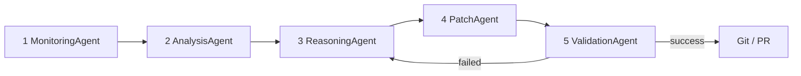
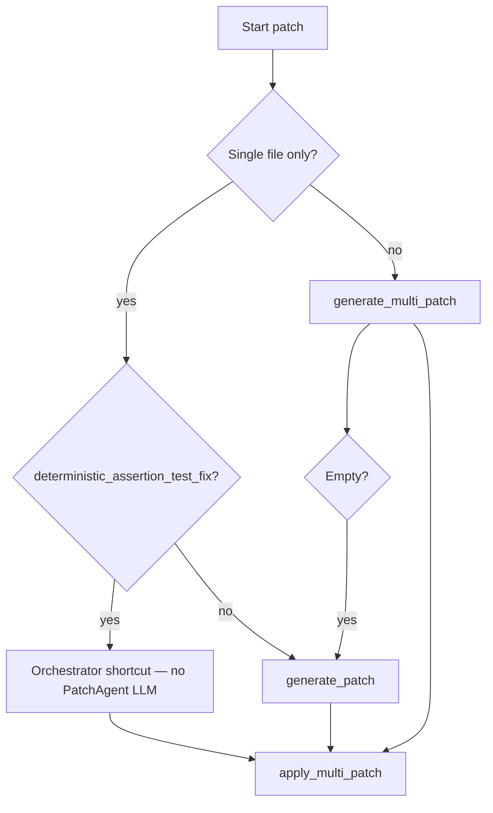

# Five-Agent Repair Pipeline

This document describes the **complete self-healing process** organized by the **five agents**: what each agent does, **when** it runs, what it receives, and what it returns.

The **`WorkflowOrchestrator`** (`orchestrator/workflow.py`) does not repair code itself. It calls the agents in order, handles retries, enforces policy, runs approval, and persists results.

Related docs: [Architecture overview](../architecture/overview.md) (system design), [README](../../README.md) (usage).

---

## Table of contents

1. [The five agents at a glance](#1-the-five-agents-at-a-glance)
2. [Master timeline — when each agent runs](#2-master-timeline--when-each-agent-runs)
3. [Agent 1 — MonitoringAgent](#3-agent-1--monitoringagent)
4. [Agent 2 — AnalysisAgent](#4-agent-2--analysisagent)
5. [Agent 3 — ReasoningAgent](#5-agent-3--reasoningagent)
6. [Agent 4 — PatchAgent](#6-agent-4--patchagent)
7. [Agent 5 — ValidationAgent](#7-agent-5--validationagent)
8. [Retry loop — agents run again](#8-retry-loop--agents-run-again)
9. [After the agents — orchestrator finish steps](#9-after-the-agents--orchestrator-finish-steps)
10. [Complete example — all five agents on `project_1`](#10-complete-example--all-five-agents-on-project_1)
11. [On GitHub Actions — what each agent sees](#11-on-github-actions--what-each-agent-sees)
12. [Quick reference table](#12-quick-reference-table)

---

## 1. The five agents at a glance

| # | Agent | File | Role | Uses LLM? |
|---|-------|------|------|-----------|
| 1 | **MonitoringAgent** | `agents/monitoring_agent.py` | Find failed CI runs; download log archives | No |
| 2 | **AnalysisAgent** | `agents/analysis_agent.py` | Parse logs; extract errors, files, failing command | Sometimes (file fallback) |
| 3 | **ReasoningAgent** | `agents/reasoning_agent.py` | Diagnose root cause | Yes |
| 4 | **PatchAgent** | `agents/patch_agent.py` | Generate and apply code fixes | Yes (or deterministic shortcut) |
| 5 | **ValidationAgent** | `agents/validation_agent.py` | Prove the patch fixes the failure | No |



---

## 2. Master timeline — when each agent runs

One full repair cycle for **one failure** looks like this:

```text
TIME ──────────────────────────────────────────────────────────────────────────►

ORCHESTRATOR: WorkflowOrchestrator.run()
│
├─► [AGENT 1] MonitoringAgent.get_failed_runs()
│       once per orchestrator run (or offline: skipped)
│
└─► for each failed run_id:
        │
        ├─► [AGENT 1] MonitoringAgent.get_workflow_logs(run_id)
        │       once per run
        │
        ORCHESTRATOR: save_and_extract_logs() + iter_log_files()
        │
        └─► for each job log file with a parseable error:
                │
                ├─► [AGENT 2] AnalysisAgent  (4 calls per failure)
                │       extract_failure_context()
                │       extract_failed_files()
                │       extract_failing_command()
                │       extract_failed_file()  (inside _resolve_target_file)
                │
                ORCHESTRATOR: path policy, dedupe, scope filter
                │
                └─► _repair_with_retries()  ─── retry loop ───┐
                        │                                      │
                        ├─► [AGENT 3] ReasoningAgent.diagnose_failure()
                        │                                      │
                        ORCHESTRATOR: approval gate             │
                        │                                      │
                        ├─► [AGENT 4] PatchAgent.generate_*()  │
                        ├─► [AGENT 4] PatchAgent.apply_*()    │
                        │                                      │
                        ├─► [AGENT 5] ValidationAgent.validate_patch()
                        │                                      │
                        └─► success? ──no──► enrich context ───┘
                                │
                               yes
                                │
                        ORCHESTRATOR: git commit, push, PR
```

### How many times each agent runs

| Agent | Typical count per failure |
|-------|----------------------------|
| MonitoringAgent | 1× `get_failed_runs` + 1× `get_workflow_logs` per run |
| AnalysisAgent | Once per log file scanned; 3–4 method calls per flagged log |
| ReasoningAgent | 1× per retry attempt (default up to 3) |
| PatchAgent | 1× generate + 1× apply per retry attempt |
| ValidationAgent | 1× per retry attempt |

---

## 3. Agent 1 — MonitoringAgent

**When it runs:** First and last among agents for log access — at the **start** of `WorkflowOrchestrator.run()`, before any other agent.

**Skipped when:** `OFFLINE_MODE=true` (orchestrator uses cached logs instead).

### Responsibility

Talk to the **GitHub Actions REST API**. Answer two questions:

1. Which workflow runs failed?
2. Where are the logs for run `{id}`?

### Method 1 — `get_failed_runs()`

**Called from:** `WorkflowOrchestrator.run()` → line ~124

**Input:** Settings (`GITHUB_TOKEN`, `GITHUB_OWNER`, `GITHUB_REPO`, filters)

**Process:**

| Step | What happens |
|------|----------------|
| 1 | If `GITHUB_TRIGGER_RUN_ID` is set (GitHub CI), fetch **only that run** |
| 2 | Else list all runs: `GET .../actions/runs` |
| 3 | Skip workflows in `EXCLUDED_WORKFLOW_NAMES` (e.g. self-heal itself) |
| 4 | Keep only runs matching `TARGET_WORKFLOW_NAMES` if set |
| 5 | Keep only `conclusion == "failure"` |
| 6 | Sort newest first |

**Output:** List of dicts:

```python
{"run_id": 12345, "name": "Test Pipeline", "status": "completed", "conclusion": "failure", ...}
```

**If empty:** Orchestrator returns `status: no_failures` — **no other agent runs**.

### Method 2 — `get_workflow_logs(run_id)`

**Called from:** `WorkflowOrchestrator._process_run()` → line ~304

**Input:** `run_id` from step above

**Process:**

```
GET /repos/{owner}/{repo}/actions/runs/{run_id}/logs
```

**Output:** Raw **ZIP bytes** (all job/step logs), or `None` on API error.

### What happens immediately after (orchestrator, not agent)

```python
extract_dir = save_and_extract_logs(logs, run_id)
# → logs/workflow_logs_{id}.zip
# → logs/extracted/{id}/**/*.txt
```

MonitoringAgent's job is done for this run until the next orchestrator invocation.

---

## 4. Agent 2 — AnalysisAgent

**When it runs:** After logs are extracted, **for each job log file** inside `_process_run()` (or `_process_offline_run()`).

**Does not run if:** Log file is a runner system file (parent dir = extract root), or `extract_failure_context()` returns empty.

### Responsibility

Turn **raw log text** into structured repair inputs:

- Error lines (is this log worth repairing?)
- Primary failing file
- All involved files
- The CI command that failed (for validation)

Delegates language parsing to `parsers/` (`PythonLogParser`, `JavaLogParser`, `GoLogParser`).

### Call sequence per log file

The orchestrator calls AnalysisAgent in this **fixed order**:

```text
1. extract_failure_context(log_text)     → if empty, SKIP this log
2. _resolve_target_file() which uses:
      extract_failed_files(log_text)
      extract_failed_file(log_text)
3. extract_failing_command(log_text)     → stored for ValidationAgent later
4. categorize_failure(errors)            → utils/errors.py (not AnalysisAgent)
```

### Method — `extract_failure_context(log_text)`

**Purpose:** **Flag** the log as containing a failure.

**How (Python):** `PythonLogParser` regex-scans for:

- `AssertionError`, `FAILED`, `ImportError`, `SyntaxError`, `ModuleNotFoundError`, `Error:`, …

**Output:** `list[str]` of error lines. **Non-empty = this log proceeds to repair.**

### Method — `extract_failed_file(log_text)`

**Purpose:** Pick the **primary** file to patch.

**How:** Parser `FILE_PATTERNS` (traceback `File "..."`, `FAILED path.py`, line numbers). If path missing on disk → **LLM fallback** asks OpenAI for one relative `.py` path.

**Output:** `str | None` — e.g. `sample_projects/project_1/test_unit_failure.py`

### Method — `extract_failed_files(log_text)`

**Purpose:** List **all** `.py` files in the traceback (for multi-file repair).

**How:** Regex on `File "..."`, `FAILED/ERROR path.py`, ImportError paths. Keeps only files that **exist on disk**.

**Output:** `list[str]` — e.g. `["sample_projects/project_11/app.py", "sample_projects/project_11/test_multi_file.py"]`

### Method — `extract_failing_command(log_text)`

**Purpose:** Find the **shell command** that failed in CI (used later by ValidationAgent).

**How:** Patterns like `##[group]Run pytest ...`, `[command]...`, `set -x` traces. Must pass `_is_replayable()` (safe binary, no `rm`/`sudo`/…).

**Output:** `str | None` — e.g. `pytest tests/ sample_projects/ -v --cov=. ...`

### Orchestrator steps between AnalysisAgent and Agent 3

AnalysisAgent does **not** enforce policy or pick final scope. The orchestrator does:

| Step | Code |
|------|------|
| Resolve primary file | `_resolve_target_file()` — prefers `sample_projects/` |
| Path allowlist | `enforce_path_policy(target_file)` |
| Dedupe | Skip if same `(run_id, file)` already handled |
| Scope filter | `_filter_files_to_scope()` — keep files in same project dir |
| Classify | `categorize_failure(errors)` → `failure_type` string |

Only then does `_repair_with_retries()` call **ReasoningAgent**.

---

## 5. Agent 3 — ReasoningAgent

**When it runs:** Inside `_repair_with_retries()`, at the **start of each retry attempt** (attempt 1, 2, … up to `MAX_RETRY_ATTEMPTS`).

**Runs before:** PatchAgent (diagnosis informs the patch).

### Responsibility

Use the LLM to explain **why** the CI failure happened and **what** should be fixed — in natural language. Does not write code.

### Method — `diagnose_failure(failure_context, failure_type)`

**Input:**

| Parameter | Source |
|-----------|--------|
| `failure_context` | Joined error lines from AnalysisAgent |
| `failure_type` | e.g. `assertion_error`, `import_error` |

**Process:**

1. Load `config/prompts/diagnosis.txt`
2. Substitute `{failure_context}`, `{failure_type}` (sanitized by `utils/prompts.py`)
3. `chat_completion_with_retry()` → OpenAI (`OPENAI_MODEL`, default `gpt-4o-mini`)

**Output:** Diagnosis string, e.g.:

```text
The test asserts add(2,2) == 999 but the function returns 4.
The expected value in the test is wrong; it should be 4.
```

**Passed to:** PatchAgent on the same attempt.

### On retry

`failure_context` is **enriched** by the orchestrator with the previous ValidationAgent output (status, scope, last 2000 chars of pytest output). ReasoningAgent sees the **expanded** context on attempts 2 and 3.

---

## 6. Agent 4 — PatchAgent

**When it runs:** Immediately after ReasoningAgent on each retry attempt, still inside `_repair_with_retries()`.

**Two phases:** Generate patch → (orchestrator approval) → Apply patch.

### Responsibility

Produce corrected file content and write it to disk.

### Phase A — Generate

The orchestrator chooses the generation path:



#### `generate_patch(failure_context, target_file, diagnosis)`

**When:** Single-file path.

**Reads from disk:**

- Full `target_file` content
- Related imports via `_collect_context_files()` / `_load_related_source()`

**Prompt:** `config/prompts/patch.txt`

**Output:** Single string — **complete corrected file** (not a diff).

#### `generate_multi_patch(failure_context, target_files, diagnosis)`

**When:** Multiple files in scope (e.g. project_11).

**Reads from disk:** All target files + locally imported modules.

**Prompt:** `config/prompts/multi_patch.txt`

**Output:** `list[FilePatch]` — parsed from LLM JSON `[{"file": "...", "content": "..."}]`.

#### Deterministic shortcut (not PatchAgent, but same step)

For single-file test `AssertionError`, orchestrator may call `deterministic_assertion_test_fix()` **instead of** PatchAgent generate — rewrites `assert actual == wrong` without LLM.

### Phase B — Orchestrator approval (between generate and apply)

`request_patch_approval()` shows diff; on GitHub CI, `AUTO_APPROVE_PATCHES=true` → always approve.

If denied → **ValidationAgent is not called**; attempt ends with `approval_denied`.

### Phase C — Apply

#### `apply_patch(file_path, patch_code)` / `apply_multi_patch(patches)`

**When:** After approval.

**How:**

1. Strip markdown code fences
2. Write to temp file `.self_heal_tmp_*` next to target
3. Atomic `Path.replace()` onto real file

**Output:** List of paths written.

**Orchestrator before apply:** `FileBackupManager.backup_originals()` (if `BACKUP_BEFORE_PATCH`).

---

## 7. Agent 5 — ValidationAgent

**When it runs:** Immediately after PatchAgent applies the patch, same retry attempt.

**Does not run if:** `DRY_RUN=true` (orchestrator skips apply and returns `dry_run` status).

### Responsibility

Answer: **Did the patch actually fix the failure?**

Runs a **subprocess** on the machine where `python main.py` is running (local laptop or GitHub Actions runner). **Does not call OpenAI.**

### Method — `validate_patch(target_file, failing_command)`

**Input:**

| Parameter | From |
|-----------|------|
| `target_file` | AnalysisAgent + orchestrator resolution |
| `failing_command` | `AnalysisAgent.extract_failing_command()` |

**Decision tree (first match wins):**

```text
1. target_file set AND NOT VALIDATE_FULL_REPO?
   └─► YES → _validate_direct()     ← MOST COMMON (sample_projects, app/)
       Run: python -m pytest -o addopts= <scope> -v --tb=short
       ON HOST (GitHub runner or your laptop)

2. failing_command safe to replay?
   └─► YES → _validate_by_replay()
       Re-run exact CI command (normalized)

3. Dockerfile exists?
   └─► YES → docker build + docker run ... pytest
       FALLBACK ONLY

4. Else → _validate_direct()
```

### On GitHub Actions (typical demo)

For `sample_projects/project_N` failures:

- **ValidationAgent uses path 1** — scoped pytest on the **ubuntu-latest runner**
- **Docker is not used** (even though Docker exists on the runner)
- Same Python 3.12 installed by the workflow step

### Output

```python
{
    "status": "success" | "failed" | "error" | "build_failed",
    "output": "<pytest stdout+stderr>",
    "category": None | "assertion_error" | ...,
    "scope": "sample_projects/project_1" | command string | ...
}
```

| status | Orchestrator action |
|--------|---------------------|
| `success` | Clear backups, optional git commit/PR, **stop retry loop** |
| `failed` / `error` | Restore files from backup, **call Agents 3–5 again** if attempts remain |
| `build_failed` | Docker build failed (rare on GitHub for sample_projects) |

---

## 8. Retry loop — agents run again

When ValidationAgent returns non-success, **only Agents 3, 4, and 5 repeat** (Monitoring and Analysis already finished for this log).

```text
Attempt 1:
  ReasoningAgent  → context = original errors
  PatchAgent      → patch v1
  ValidationAgent → FAILED

Attempt 2:
  ReasoningAgent  → context = original + validation output from attempt 1
  PatchAgent      → patch v2
  ValidationAgent → FAILED

Attempt 3:
  ReasoningAgent  → context = original + validation output from attempt 2
  PatchAgent      → patch v3
  ValidationAgent → SUCCESS → done
```

Each attempt is recorded in `FailureMemory` (`results/failure_memory.json`).

After all attempts exhausted: orchestrator restores originals, status `repair_failed`.

---

## 9. After the agents — orchestrator finish steps

These are **not** agents but run when ValidationAgent succeeds:

| Step | Component | When |
|------|-----------|------|
| Git commit | `GitRepairManager.commit_repair()` | `GIT_ENABLED=true`, not dry-run |
| Push branch | `GitRepairManager.push_branch()` | End of run processing |
| Open PR | `GitRepairManager.create_pull_request()` | `GIT_CREATE_PR=true` |
| Persist results | `ResultsStore`, `audit_log` | Every run |

On GitHub auto-heal: `GIT_ENABLED=true`, `AUTO_APPROVE_PATCHES=true`, human merges PR later.

---

## 10. Complete example — all five agents on `project_1`

**Setup:** `./scripts/break-sample.sh 1` → test expects `999` instead of `4`. Push → Test Pipeline fails.

### Agent 1 — MonitoringAgent

| Call | Result |
|------|--------|
| `get_failed_runs()` | `[{run_id: 98765, name: "Test Pipeline", conclusion: "failure"}]` |
| `get_workflow_logs(98765)` | ZIP bytes → extracted to `logs/extracted/98765/` |

### Agent 2 — AnalysisAgent

Log file: `test/4_Run tests with coverage.txt`

| Call | Result |
|------|--------|
| `extract_failure_context()` | `["FAILED ...test_unit_failure.py::test_add - AssertionError: assert 4 == 999", ...]` |
| `extract_failed_files()` | `["sample_projects/project_1/test_unit_failure.py"]` |
| `extract_failed_file()` | `sample_projects/project_1/test_unit_failure.py` |
| `extract_failing_command()` | `pytest tests/ sample_projects/ -v --cov=...` |

Orchestrator: policy OK, scope = `sample_projects/project_1`, `failure_type = assertion_error`.

### Agent 3 — ReasoningAgent (attempt 1)

| Input | Diagnosis output |
|-------|------------------|
| Error lines + `assertion_error` | "Test expected 999 but add(2,2) returns 4; fix expected value to 4." |

### Agent 4 — PatchAgent (attempt 1)

| Path | Action |
|------|--------|
| Deterministic shortcut | Parses `assert 4 == 999` → rewrites test to `== 4` |
| `apply_multi_patch()` | Writes corrected `test_unit_failure.py` |

(GitHub: auto-approved without prompt.)

### Agent 5 — ValidationAgent (attempt 1)

| Method | Command run on GitHub runner |
|--------|------------------------------|
| `_validate_direct()` | `python -m pytest -o addopts= sample_projects/project_1 -v --tb=short` |

| Result | `status: success` |

### Orchestrator finish

- Commit on `self-heal/run-98765-{timestamp}`
- Push + open PR
- **No retry** — Agents 3–5 not called again

---

## 11. On GitHub Actions — what each agent sees

| Agent | On GitHub (`self-heal.yml`, automatic failure) |
|-------|-----------------------------------------------|
| **MonitoringAgent** | `GITHUB_TOKEN` from `github.token`; `GITHUB_TRIGGER_RUN_ID` = failed Test Pipeline run |
| **AnalysisAgent** | Logs from that run's ZIP; same parsers as local |
| **ReasoningAgent** | `OPENAI_API_KEY` from repo secret |
| **PatchAgent** | Writes into checked-out repo on runner; `AUTO_APPROVE_PATCHES=true` |
| **ValidationAgent** | **Host pytest** on runner (not Docker) for `sample_projects/` |

**Pre-flight `python main.py check`:** Verifies Docker exists on runner, but ValidationAgent typically **does not use it** for scoped repairs.

**Manual workflow_dispatch with `dry_run=true`:** Agents 1–2 and 3–4 (generate only) may run; PatchAgent does not apply; ValidationAgent does not run.

---

## 12. Quick reference table

### Inputs and outputs per agent

| Agent | Trigger | Main inputs | Main outputs |
|-------|---------|-------------|--------------|
| MonitoringAgent | Start of `run()` | GitHub API, env tokens | `run_id` list, log ZIP |
| AnalysisAgent | Per log file | `log_text` string | errors, files, command |
| ReasoningAgent | Per retry attempt | `failure_context`, `failure_type` | diagnosis text |
| PatchAgent | Per retry attempt | context, files, diagnosis | patched files on disk |
| ValidationAgent | After each apply | `target_file`, `failing_command` | success/failed + pytest output |

### Agent call order (single failure, single attempt)

```text
MonitoringAgent.get_failed_runs()
MonitoringAgent.get_workflow_logs(run_id)
AnalysisAgent.extract_failure_context(log)
AnalysisAgent.extract_failed_files(log)
AnalysisAgent.extract_failed_file(log)      # via orchestrator
AnalysisAgent.extract_failing_command(log)
ReasoningAgent.diagnose_failure(context, type)
PatchAgent.generate_patch() OR generate_multi_patch()
PatchAgent.apply_patch() OR apply_multi_patch()
ValidationAgent.validate_patch(file, command)
```

### Source files

| Agent | File |
|-------|------|
| MonitoringAgent | `agents/monitoring_agent.py` |
| AnalysisAgent | `agents/analysis_agent.py` |
| ReasoningAgent | `agents/reasoning_agent.py` |
| PatchAgent | `agents/patch_agent.py` |
| ValidationAgent | `agents/validation_agent.py` |
| Coordinator | `orchestrator/workflow.py` |

---

*For system-wide design and jury Q&A, see [Architecture overview](../architecture/overview.md).*
